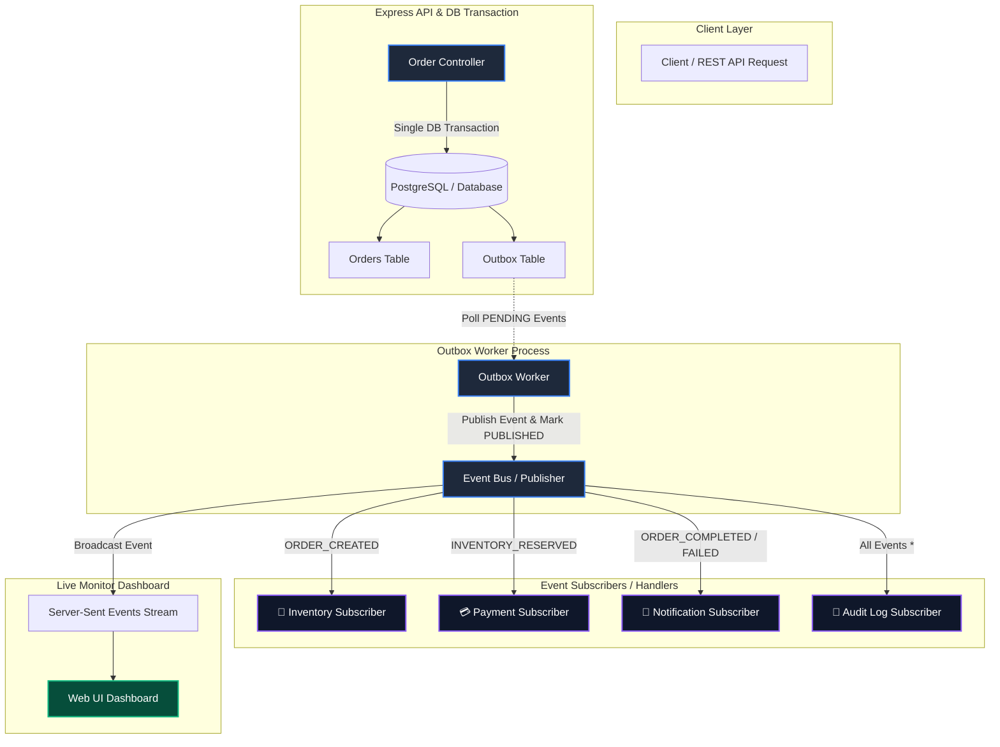
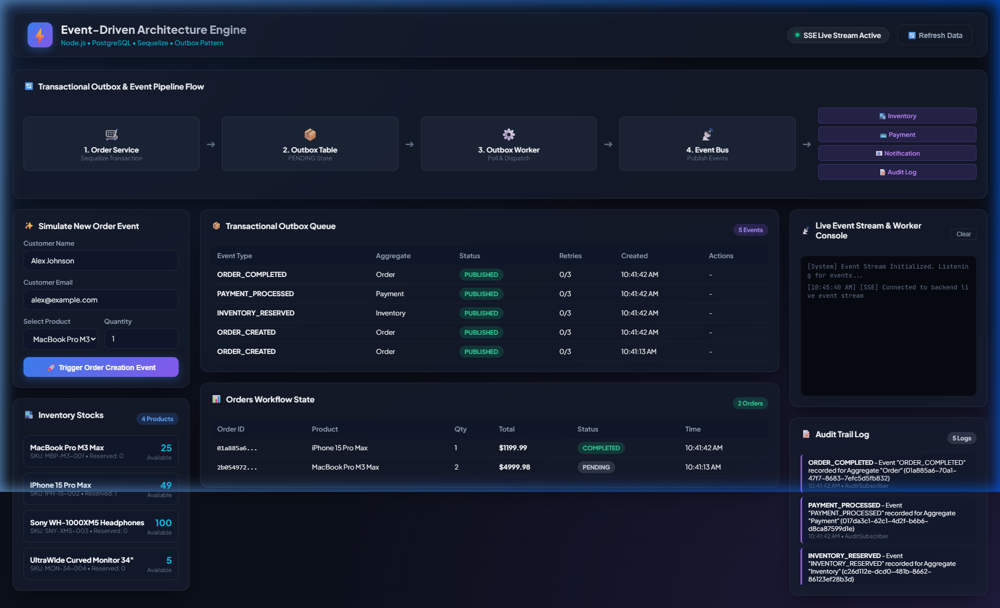
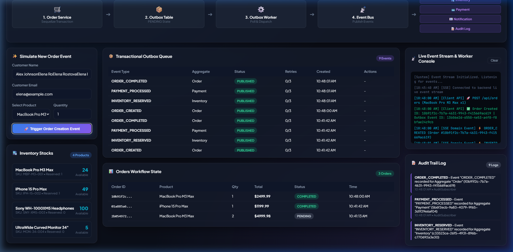

# Event-Driven Architecture System (Node.js, PostgreSQL, Sequelize)

A production-grade **Event-Driven Architecture (EDA)** built with **Node.js**, **PostgreSQL**, and **Sequelize ORM**. It implements the **Transactional Outbox Pattern** to guarantee reliable event delivery, decoupled domain subscribers, and a live web monitor dashboard with real-time Server-Sent Events (SSE).

---

## 📐 Architecture Diagram



---

## 📸 Dashboard Screenshots

### 1. Initial Dashboard State
Overview of the system layout including the active pipeline visualizer, stock inventory items, transactional outbox queue, orders state, and live SSE event console.



### 2. Live Event Simulation & Completed Order Pipeline
Showing the end-to-end event execution flow after placing an order. The Outbox events transition to `PUBLISHED`, stock is dynamically reserved, payment is processed, and email notification is sent in real-time.



---

## 🌟 Key Features

1. **Transactional Outbox Pattern**:
   - Eliminates dual-write inconsistencies (e.g., database commit succeeds but event publication fails).
   - Domain operations (`Order.create`) and Outbox event registration (`Outbox.create`) occur inside a **single database transaction**.
2. **Decoupled Subscribers / Handlers**:
   - **Inventory Subscriber**: Reserves stock on `ORDER_CREATED` or triggers `ORDER_FAILED` on insufficient stock.
   - **Payment Subscriber**: Simulates payment processing on `INVENTORY_RESERVED`, creating transaction records and marking `ORDER_COMPLETED`.
   - **Notification Subscriber**: Triggers simulated emails/alerts to users upon order completion/failure.
   - **Audit Subscriber**: Listens to all system events (`*`) and stores structured logs in PostgreSQL.
3. **Outbox Worker**:
   - Background worker fetching `PENDING` events from outbox table, dispatching them to the event bus, and setting status to `PUBLISHED` or handling exponential retries for `FAILED` events.
4. **PostgreSQL & SQLite Seamless Fallback**:
   - Automatically connects to PostgreSQL using Sequelize ORM.
   - Falls back to SQLite if PostgreSQL is not running locally, ensuring zero setup friction.
5. **Interactive Web Dashboard**:
   - Real-time pipeline visualizer showing active node transitions.
   - Order simulation form.
   - Outbox queue inspector with retry actions.
   - Real-time console streaming events via **SSE (Server-Sent Events)**.

---

## 🛠️ Tech Stack

- **Runtime**: Node.js (v18+)
- **Framework**: Express.js
- **Database**: PostgreSQL (with Sequelize ORM) & SQLite fallback
- **Event Engine**: Node.js `EventEmitter` & Server-Sent Events (SSE)
- **UI**: Vanilla HTML5, Modern CSS (Glassmorphism & Dark Mode), Modern JS (ES6+)

---

## 📂 Project Structure

```text
d:/Projects/NodeJS/event_driven/
├── config/
│   └── database.js               # PostgreSQL connection + SQLite fallback
├── models/
│   ├── Order.js                  # Order domain model
│   ├── Outbox.js                 # Transactional Outbox model
│   ├── Inventory.js              # Stock inventory model
│   ├── Payment.js                # Payment transaction model
│   ├── AuditLog.js               # Audit log model
│   └── index.js                  # Model registry & associations
├── events/
│   ├── eventBus.js               # EventEmitter + SSE Broadcaster
│   └── outboxWorker.js           # Transactional Outbox processor
├── subscribers/
│   ├── inventorySubscriber.js    # Inventory stock handler
│   ├── paymentSubscriber.js      # Payment processor handler
│   ├── notificationSubscriber.js # Customer notification handler
│   ├── auditSubscriber.js        # Global audit log handler
│   └── index.js                  # Subscriber registration
├── controllers/
│   ├── orderController.js        # Order REST controller
│   ├── eventController.js        # Outbox & SSE controller
│   └── inventoryController.js    # Inventory controller
├── routes/
│   └── api.js                    # Express API routes
├── public/
│   ├── index.html                # Event Monitor Dashboard
│   ├── css/style.css             # Glassmorphism Dark Theme
│   └── js/app.js                 # Real-time SSE Dashboard app
├── screenshots/
│   ├── initial_dashboard.png     # Initial dashboard screenshot
│   └── completed_dashboard.png   # Completed event flow screenshot
├── .env                          # Environment configuration
├── README.md                     # Documentation with diagram & screenshots
└── server.js                     # Server entry point
```

---

## 🚀 Getting Started

### 1. Install Dependencies
```bash
npm install
```

### 2. Configure Environment Variables (`.env`)
Create or edit `.env`:
```env
DB_DIALECT=postgres
DB_HOST=localhost
DB_PORT=5432
DB_NAME=event_driven_db
DB_USER=postgres
DB_PASSWORD=postgres

PORT=3000
OUTBOX_POLL_INTERVAL_MS=1000
```

### 3. Start the Engine & Dashboard
```bash
npm start
```

Open your browser at:
**`http://localhost:3002`** (or default port specified in `.env`)

---

## 📡 API Reference

### Orders
- `POST /api/orders` - Place order & write outbox event atomically.
  - Body: `{ "customerName": "Alex", "customerEmail": "alex@example.com", "productName": "MacBook Pro M3 Max", "quantity": 1 }`
- `GET /api/orders` - List all orders.
- `GET /api/orders/:id` - Get order by ID with payment details.

### Outbox & Events
- `GET /api/outbox` - List all outbox events and current status (`PENDING`, `PROCESSING`, `PUBLISHED`, `FAILED`).
- `POST /api/outbox/:id/retry` - Reset a failed outbox event to `PENDING`.
- `GET /api/audit-logs` - Fetch system audit logs.
- `GET /api/events/stream` - SSE endpoint for live event streaming.

### Inventory
- `GET /api/inventory` - Fetch current product stock.
- `PATCH /api/inventory/:id` - Update stock levels.
